<div align="center">

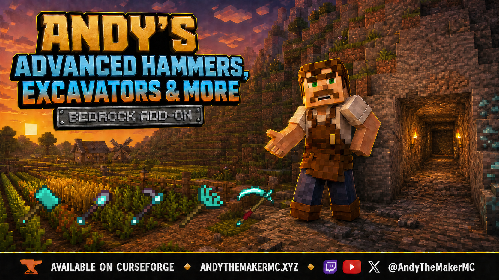

</div>

# Andy's Advanced Hammers, Excavators & More

**Five tool families. Seven tiers. Every swing shows you exactly what it will take.**

A Minecraft Bedrock add-on adding Hammers, Excavators, Tillers, Scythes, and Seeder Rakes — a complete set of area tools for the four jobs vanilla makes you do one block at a time. Hammers and Excavators clear a shape you configure yourself. Tillers lay out a whole 9×9 farm, including researched optimal plot layouts for pumpkins, melons, and sugar cane. Scythes sweep vegetation and harvest ripe crops without wrecking the field underneath. Seeder Rakes plant a 4×4 plot straight from your inventory.

Hold any of the five tools and a wireframe outline shows the exact blocks that swing will affect, before you commit to it.

**Current version: 0.1.28**

## Download

**[Andys_Advanced_Hammers_Excavators_And_More_0.1.28.mcaddon](./Andys_Advanced_Hammers_Excavators_And_More_0.1.28.mcaddon)**

```text
SHA-256  21082ecc23e0f5c937cf4da9ed30bc55810801ea0db77f0deb3d544be73b8868
```

## Requirements

| | |
|---|---|
| Minimum Bedrock version | 1.26.30 |
| Graphics | Standard graphics and Vibrant Visuals |
| Experimental toggles | None required |
| Cheats | Not required for any player-facing feature |
| Dependencies | None |
| Achievement compatible | Yes — verified in a cheats-off survival world with no experiments |

## Features

- **Hammers** — area mining for stone, ore, and metal. Only takes blocks in the same family as the one you hit, so a swing into stone leaves an embedded ore untouched. Ore families group their Deepslate variants; copper families ignore waxing and oxidation.
- **Excavators** — the same for dirt, sand, gravel, snow, clay, mud, soul sand, soul soil, and concrete powder.
- **Configurable break region** — Cuboid or ascending/descending stair-step, 1–5 in each axis up to a 125-block cap, aimed at the face you hit or locked to a world plane.
- **Tillers** — a full 9×9 farm in one interaction, clearing plants, preserving existing water, and opening a centre irrigation hole. Three selectable layouts: standard field, optimal pumpkin and melon plot, optimal sugar cane plot with dug channels.
- **Optional Tiller irrigation** — fill the centre hole with a waterlogged block and raise a lit lamppost over it, both paid for from your own inventory.
- **Scythes** — sweep a 9×9 of vegetation including the tops of tall plants, or harvest the mature crops in a 3×3. Harvested crops are not reset or replanted, and the farmland underneath is never damaged.
- **Seeder Rakes** — plant a 4×4 plot from your inventory, checked against real vanilla placement rules for all thirteen supported crops.
- **Live previews** — every tool outlines exactly what it will change: white for blocks that change, blue for water, green for rows a plot layout leaves open.
- **Vanilla everything else** — Fortune, Silk Touch, Unbreaking, Efficiency, and Mending all work through vanilla systems. Drops match a normal tool and keep the standard five-minute item lifetime.
- **Never breaks** containers, technical blocks, portals, or unbreakable blocks, in any pattern.
- **Server controls** — five global tool toggles on the world settings screen, in an operator menu, and from a dedicated-server console.

## See it working

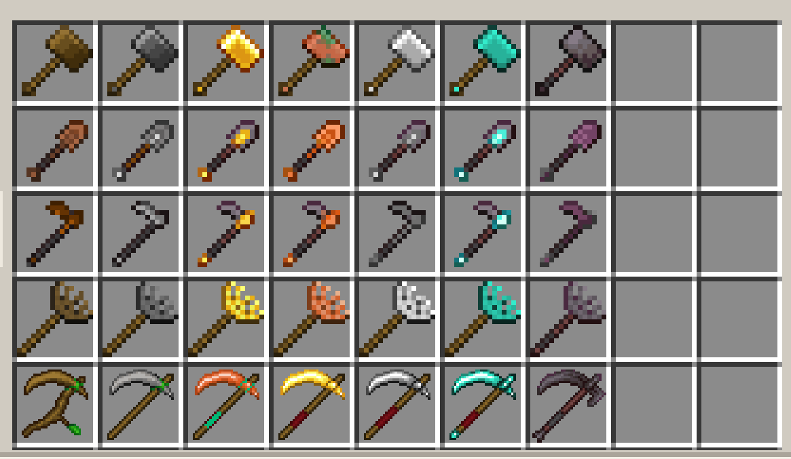

*All five families across all seven tiers - 35 tools.*

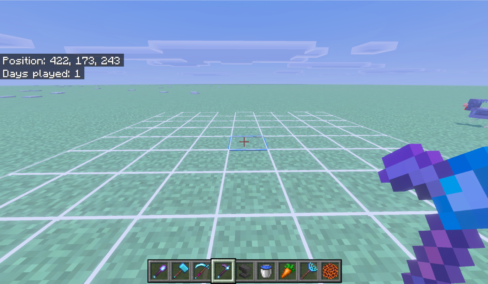

*Hold a Tiller and the whole 9x9 is outlined before you commit. Blue marks the centre irrigation hole.*

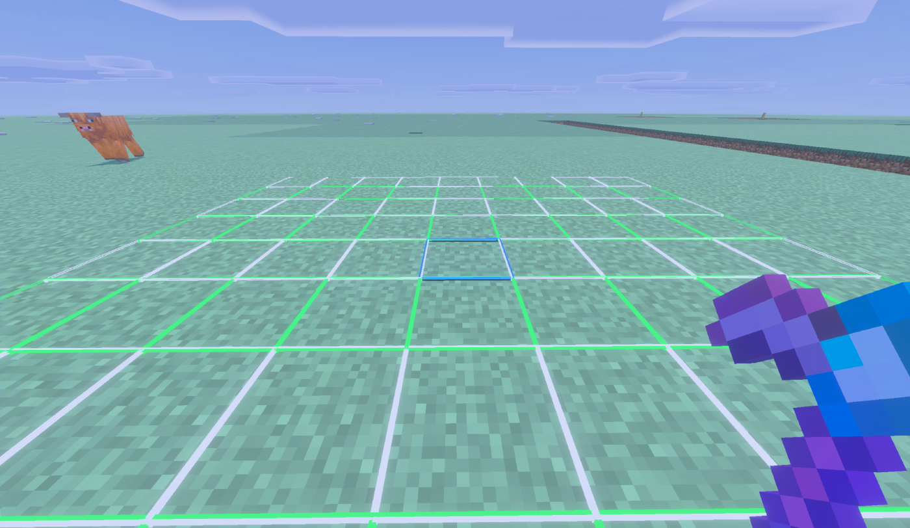

*The pumpkin and melon plot: white stem rows, green fruit rows left open, blue centre. All three shades at once.*

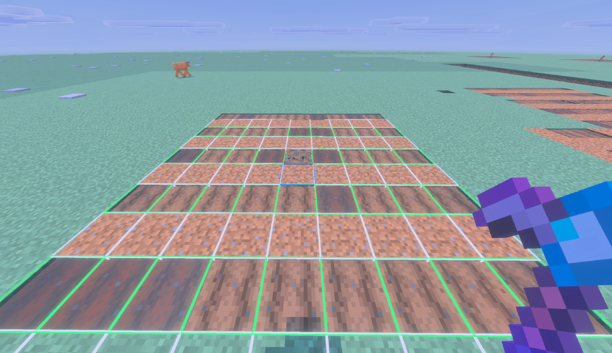

*The same plot after one interaction - five farmland stem rows facing four open dirt rows.*

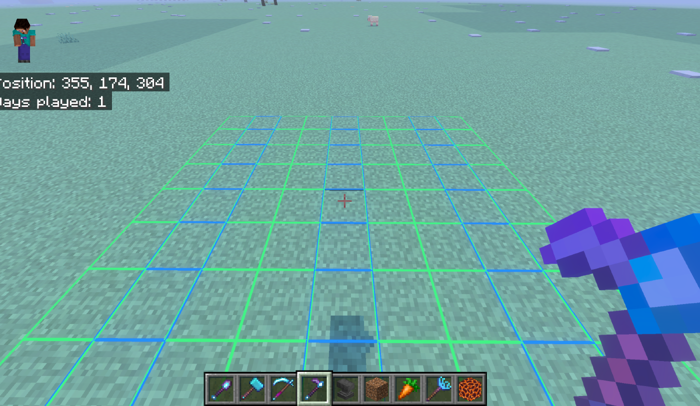

*The sugar cane plot: a channel every third row, so every growing row touches water.*

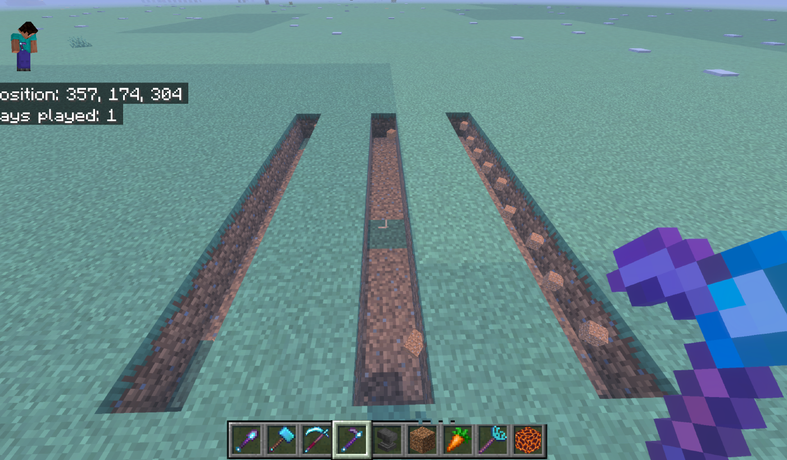

*Dug and ready. Two buckets flood each nine-long channel - the tool never creates water for free.*

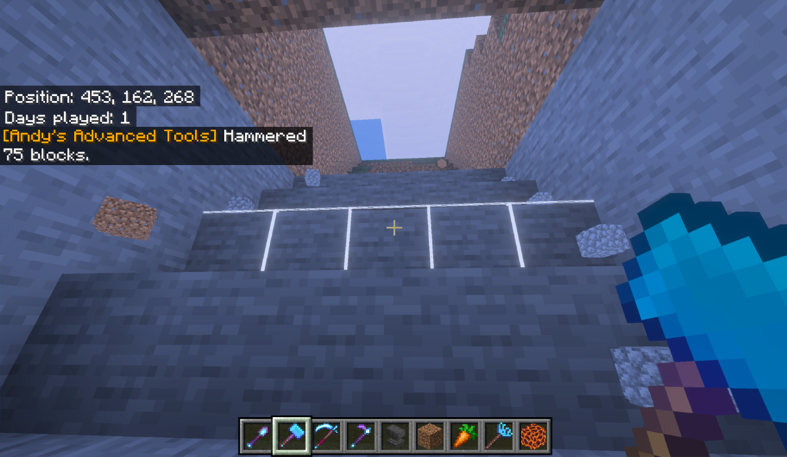

*A Hammer cutting a descending staircase. The chat line reports what the last swing took.*

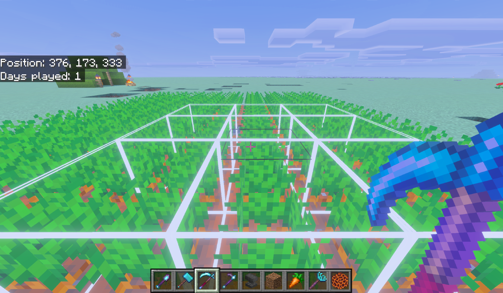

*The Scythe harvest preview. Only mature crops inside it are taken, and the farmland survives.*

## Crafting

Every tool is crafted at a Crafting Table from a tier material and Sticks. **Material** is whichever tier you are making: any Planks, Cobblestone / Blackstone / Cobbled Deepslate, Copper Ingot, Gold Ingot, Iron Ingot, or Diamond. Netherite is not crafted in a grid - upgrade a finished Diamond tool at a Smithing Table with a Netherite Upgrade Smithing Template and a Netherite Ingot.

Shown at Diamond tier:

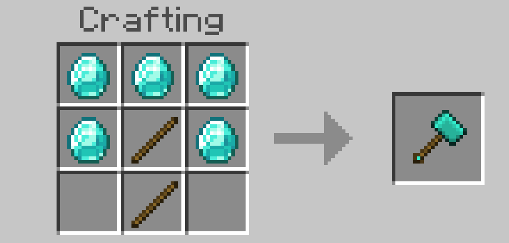

***Hammer** - 5 Material + 2 Sticks*

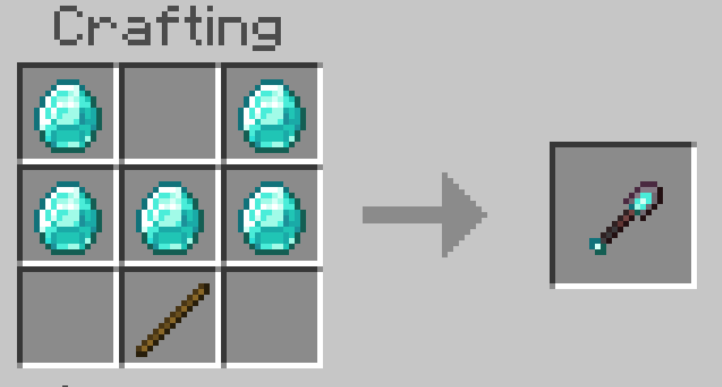

***Excavator** - 5 Material + 1 Stick*

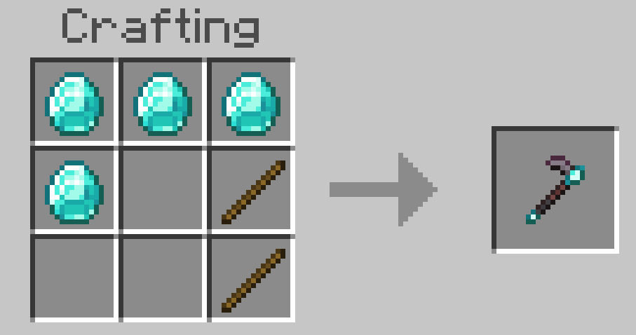

***Tiller** - 4 Material + 2 Sticks*

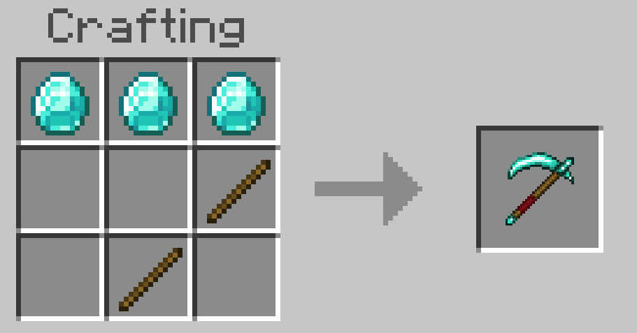

***Scythe** - 3 Material + 2 Sticks*

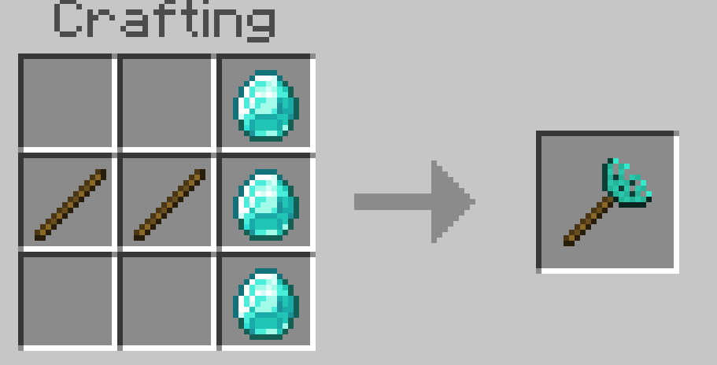

***Seeder Rake** - 3 Material + 2 Sticks*

The Tiller, Scythe, and Seeder Rake shapes are not symmetric, so each also crafts mirrored.

## Installation

1. Download the `.mcaddon` linked above.
2. Open it with Minecraft Bedrock and wait for both packs to import.
3. Create a world, or edit an existing one.
4. Under **Behavior Packs → My Packs**, activate **Andy's Advanced Hammers, Excavators & More [BP]**.
5. Confirm **Andy's Advanced Hammers, Excavators & More [RP]** is active under Resource Packs. The packs are linked, but verify both.
6. Enter the world and craft your first tool at a Crafting Table.

On Android and iOS, share the `.mcaddon` to Minecraft and activate both packs on the intended world. For consoles, prepare the world on a desktop or mobile device, upload it to a Realm, and join from the console.

## Controls

| Action | Hammer | Excavator | Tiller | Scythe | Seeder Rake |
|---|---|---|---|---|---|
| Break a block | Area mine | Area dig | — | Sweep or harvest | — |
| Use on a block | — | — | Prepare the plot | Sweep or harvest | Plant the 4×4 |
| Crouch + use | Shape menu | Shape menu | Tiller menu | — | Crop selector |

Crouching also hides the preview outline, so a menu always opens with a clear view.

## Menus

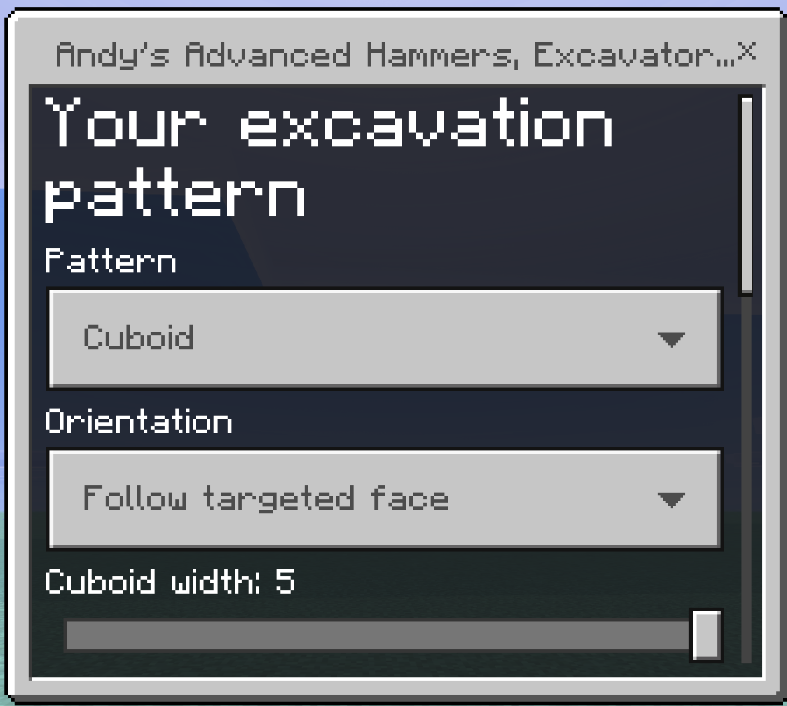

*Crouch-use a Hammer or Excavator for the shape menu: pattern, orientation, and four size sliders.*

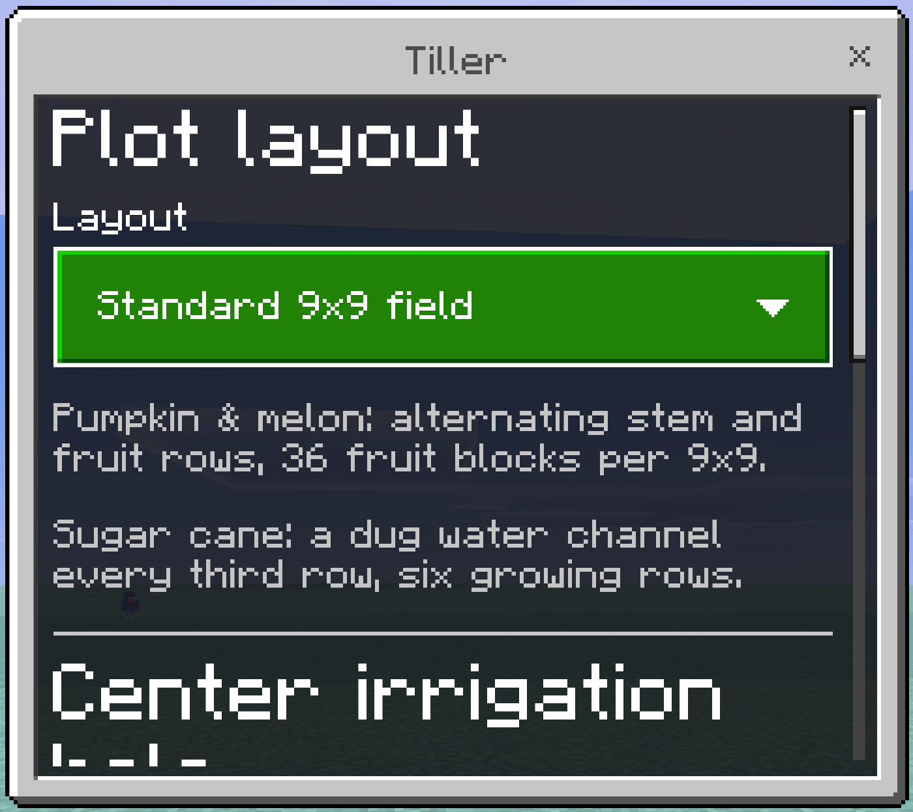

*Crouch-use a Tiller for the plot layout and both irrigation options.*

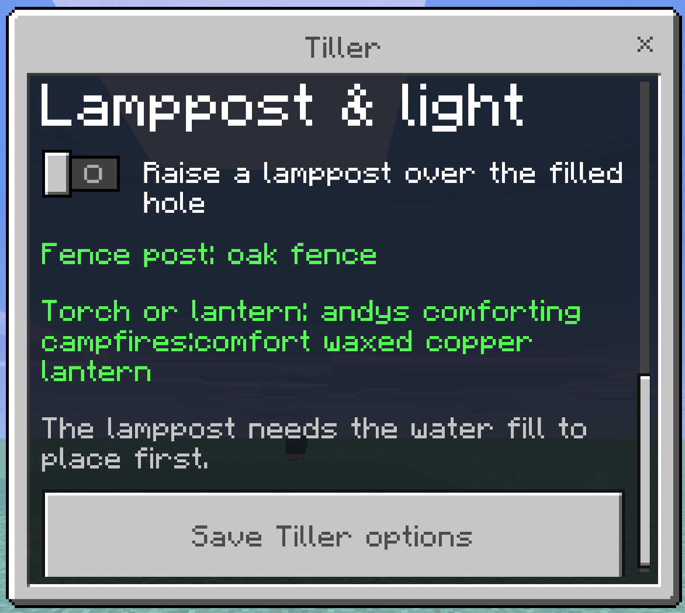

*Every option says, in green or red, whether the items it needs are actually in your inventory.*

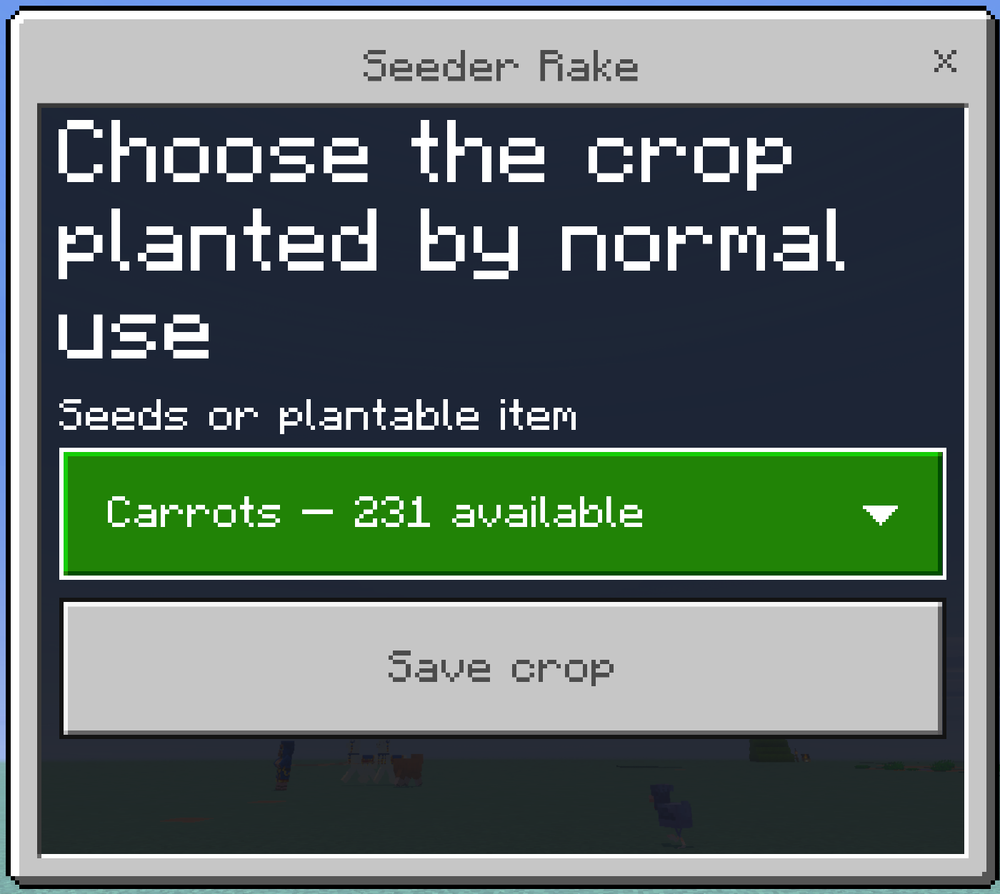

*Crouch-use a Seeder Rake to pick a crop. Each entry shows how many you are carrying.*

## Server and operator controls

Each of the five families can be turned off independently, from the world settings screen, from the operator section of the shape menu, or from a console:

```text
scriptevent andys_excavators:set <hammer|excavator|tiller|scythe|seeder> <on|off>
scriptevent andys_excavators:list
scriptevent andys_excavators:status
scriptevent andys_excavators:reset
scriptevent andys_excavators:help
```

Only operators and the dedicated-server console may change these. Tool availability is stored on the world; each player's shape, crop choice, and Tiller options are stored per player.

## Tool texture attribution

This add-on uses selected tool textures from the following open-source Minecraft projects. Some textures were recolored or renamed to fit this add-on's supported material tiers.

**Hammers** — Wooden, Golden, Iron, and Netherite Hammer textures from Vanilla Hammers by Draylar and contributors ([GitHub](https://github.com/Draylar/vanilla-hammers), MIT License). Copper and Diamond Hammer textures from More Hammers & Excavators by ianm1647 ([GitHub](https://github.com/ianm1647/more-hammers-and-excavators), MIT License).

**Excavators and Tillers** — derived from Advanced Netherite – Bedrock Edition, reworked by Lilium Studio ([GitHub](https://github.com/LiliumStudio/Advanced-Netherite-Bedrock-Edition), GPL-3.0). That project credits the original Java textures to LizterZapZap and the original Advanced Netherite project by Autovw ([GitHub](https://github.com/Autovw/AdvancedNetherite)).

**Scythes** — from Server-Side Scythes by agmass ([GitHub](https://github.com/agmass/Server-Side-Scythes), LGPL-2.1).

**Seeder Rakes** — from Rake by Exline ([GitHub](https://github.com/jexline/rake), CC0-1.0).

All original assets remain subject to their respective licenses.

## License

All Rights Reserved. See [LICENSE.md](./LICENSE.md) for end-user and content-creator permissions.

Minecraft is a trademark of Microsoft Corporation. This project is not affiliated with, endorsed by, sponsored by, or associated with Microsoft or Mojang Studios.

---

<div align="center">

**[AndyTheMakerMC.xyz](https://andythemakermc.xyz/)** · [YouTube](https://www.youtube.com/@AndyTheMakerMC) · [Twitch](https://twitch.tv/AndyTheMakerMC) · [X](https://x.com/AndyTheMakerMC) · [TikTok](https://www.tiktok.com/@AndyTheMakerMC) · [Instagram](https://www.instagram.com/AndyTheMakerMC)

</div>
