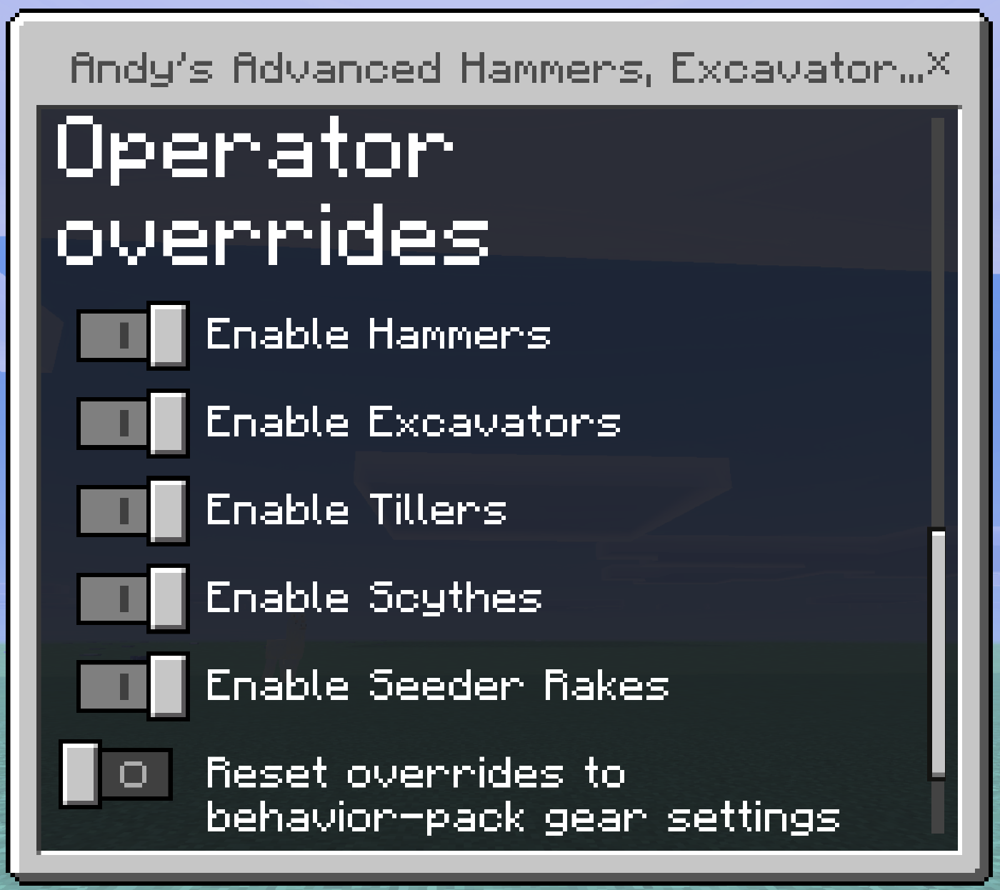

  

# Andy's Advanced Hammers, Excavators & More

**Mine, shape, prepare, harvest, and plant whole areas with quiet, previewed Survival tools.**

Five tool families across seven vanilla-style tiers speed up repetitive work while preserving normal loot, enchantments, durability costs, protected blocks, and achievement-friendly world settings.

  

_Hammers, Excavators, Tillers, Scythes, and Seeder Rakes from Wooden through Netherite._

**Current release:** 0.1.29

**Download:** [Andys_Advanced_Hammers_Excavators_And_More_0.1.29.mcaddon](Andys_Advanced_Hammers_Excavators_And_More_0.1.29.mcaddon)

**SHA-256:** `A70A929246F44E3FAD14AD4F29EB3D32D2F6805C0C6DD59AAE9CBA933F13A84F`

Minecraft Bedrock **1.26.30 or newer** is required. Activate both included packs. No cheats, commands, experimental gameplay toggles, or additional dependencies are required. Standard graphics and Vibrant Visuals are supported.

The complete player, user, and admin documentation is in the [GitHub Wiki](https://github.com/CharlesJGantt/andys-advanced-hammers-excavators-and-more/wiki).

## Features

- Hammers mine configurable cuboids and stair-steps through stone, ore, and metal families.
- Excavators apply the same patterns to dirt, sand, gravel, snow, clay, mud, and related terrain.
- Tillers prepare standard, pumpkin/melon, or sugar-cane 9×9 plots with optional inventory-funded irrigation and lighting.
- Scythes clear 9×9 vegetation or harvest mature crops in a 3×3 without breaking farmland.
- Seeder Rakes plant thirteen supported crops in a validated, inventory-funded 4×4.
- White, blue, and green wireframes preview affected, water, and deliberately open cells.
- All ordinary tool use is silent: no completion counts or debug notices fill chat or the action bar.
- World owners can independently disable each family in pack settings, an operator form, or the BDS console.
- All 35 recipes register automatically when Andy's Salvage Table is installed; the integration is optional.

## Crafting Recipes

Use the material for the chosen tier. Wooden accepts Planks; Stone accepts Cobblestone, Blackstone, or Cobbled Deepslate; Copper, Gold, Iron, and Diamond use their matching material.

### Hammer

| | | |
| --- | --- | --- |
| Material | Material | Material |
| Material | Stick | Material |
| | Stick | |

### Excavator

| | | |
| --- | --- | --- |
| Material | | Material |
| Material | Material | Material |
| | Stick | |

### Tiller

| | | |
| --- | --- | --- |
| Material | Material | Material |
| Material | | Stick |
| | | Stick |

### Scythe

| | | |
| --- | --- | --- |
| Material | Material | Material |
| | | Stick |
| | Stick | |

### Seeder Rake

| | | |
| --- | --- | --- |
| | | Material |
| Stick | Stick | Material |
| | | Material |

Upgrade each Diamond tool at a Smithing Table with a Netherite Upgrade Smithing Template and Netherite Ingot.

## Installation

### Windows, Android, iPhone, and iPad

1. Download [Andys_Advanced_Hammers_Excavators_And_More_0.1.29.mcaddon](Andys_Advanced_Hammers_Excavators_And_More_0.1.29.mcaddon).
2. Open it with Minecraft Bedrock and wait for both packs to import.
3. Create or edit a world.
4. Activate **Andy's Advanced Hammers, Excavators & More [BP]** under Behavior Packs.
5. Confirm **Andy's Advanced Hammers, Excavators & More [RP]** is active under Resource Packs.
6. Craft a tool and aim at a valid target to see its selection preview.

Back up an important world before installing or updating any add-on.

### Xbox, PlayStation, and Nintendo Switch

Import and activate the add-on on Windows or mobile, upload the prepared world to a Realm, and join that Realm from the console.

## Controls and menus

1. Hold a tool and use its wireframe to inspect the next affected area.
2. Break a block with a Hammer or Excavator to apply the selected mining pattern.
3. Use a Tiller, Scythe, or Seeder Rake on a valid target to perform its area action.
4. Crouch-use a Hammer or Excavator for pattern controls, a Tiller for layouts and irrigation, or a Seeder Rake for crop selection.
5. Operators see global family overrides in the pattern menu; BDS operators can use `scriptevent andys_excavators:help`.

  

## Compatibility and limitations

- Minecraft Bedrock 1.26.30 or newer
- Both included packs must be active; no required add-on dependencies
- Standard graphics and Vibrant Visuals/PBR
- Single-player, multiplayer, Realms, and compatible Bedrock servers
- No cheats, commands, or experimental toggles required for normal play
- Area selections are capped at 125 blocks and previews at 128 outlines
- Third-party blocks participate only when they expose compatible vanilla-style tags

See [Compatibility and Troubleshooting](https://github.com/CharlesJGantt/andys-advanced-hammers-excavators-and-more/wiki/Compatibility-and-Troubleshooting) for detailed diagnostics.

## Support AndyTheMakerMC

All of my Minecraft Bedrock add-ons are free to download and use. If one of my add-ons has improved your world, saved you time, or added something you wish Minecraft already had, consider supporting continued development. Your support helps fund the time and tools required to maintain existing add-ons, test new Minecraft Bedrock releases, fix bugs, create documentation and artwork, and continue building new add-ons.

**Help me keep these add-ons free, updated, and actively maintained** — support through [Buy Me a Coffee](https://www.buymeacoffee.com/AndyTheMakerMC) or a direct donation through [Stripe](https://buy.stripe.com/4gM4gz0qu0xwgxw0IfcMM00). Prefer another way? [Ko-fi](https://ko-fi.com/andythemaker) · [Patreon](https://www.patreon.com/cw/AndyTheMakerMC) · [GitHub Sponsors](https://github.com/sponsors/CharlesJGantt). Every bit of support is appreciated, but it is never required.

Enjoying the add-on? Ratings, favorites, recommendations, and kind comments also help more Bedrock players discover Andy's work.

### Explore more of Andy's add-ons

Visit [AndyTheMakerMC.xyz](https://andythemakermc.xyz/) for more Minecraft Bedrock add-ons, `.mcstructure` downloads, HoloPrint files, world lore, tutorials, guides, videos, and other creations.

### Follow AndyTheMakerMC

Follow **@AndyTheMakerMC** for new add-on releases, development updates, tutorials, showcases, streams, and more Minecraft adventures, and join the community on Discord and Facebook:

- [YouTube](https://www.youtube.com/@AndyTheMakerMC)
- [Twitch](https://www.twitch.tv/AndyTheMakerMC)
- [TikTok](https://www.tiktok.com/@AndyTheMakerMC)
- [Instagram](https://www.instagram.com/andythemakermc/)
- [X (Twitter)](https://x.com/AndyTheMakerMC)
- [Discord](https://discord.gg/KVFNHf67Y)
- [Facebook Group](https://www.facebook.com/groups/1728623358327048)

## End-user permission

You may download the official, unmodified release of Andy's Advanced Hammers, Excavators & More from its official CurseForge or authorized GitHub project page and install, activate, and use it in personal single-player worlds, multiplayer worlds, Realms, and compatible Bedrock servers.

This permission includes Minecraft's normal automatic delivery of the official, unmodified add-on to players joining a world, Realm, or server where it is active. It does not permit offering the add-on file separately or distributing it as part of a world download, modpack, bundle, mirror, archive, or server download.

## Content-creator permission

Content creators may use an official, unmodified release of Andy's Advanced Hammers, Excavators & More in original gameplay videos, livestreams, screenshots, tutorials, reviews, showcases, articles, guides, social posts, and other original content, including monetized content.

Credit to **AndyTheMakerMC** and a link to the official CurseForge project page are appreciated whenever practical. This permission covers display of normal gameplay and commentary; it does not grant permission to redistribute, modify, extract, or republish the add-on or its assets.

## License — All Rights Reserved

**All Rights Reserved. Copyright © 2026 Andy / AndyTheMakerMC.**

You may not redistribute, reupload, rehost, mirror, resell, sublicense, bundle, repackage, modify and publish, translate, adapt, decompile, disassemble, reverse engineer, extract, or reuse the add-on, its source code, scripts, documentation, branding, textures, models, pack icons, or promotional artwork without prior written permission from the copyright holder.

You may not create derivative works or incorporate any portion of the project into another add-on, Behavior Pack, Resource Pack, application, product, modpack, download, or project without prior written permission. The end-user and content-creator permissions above are limited permissions; they do not transfer ownership or grant redistribution rights.

The promotional artwork is original AI-assisted concept artwork directed for this project. It is not an in-game screenshot.

Minecraft is a trademark of Microsoft Corporation. This project is not affiliated with, endorsed by, sponsored by, or associated with Microsoft or Mojang Studios.

See [LICENSE.md](LICENSE.md) for the complete license and permitted-use terms.
